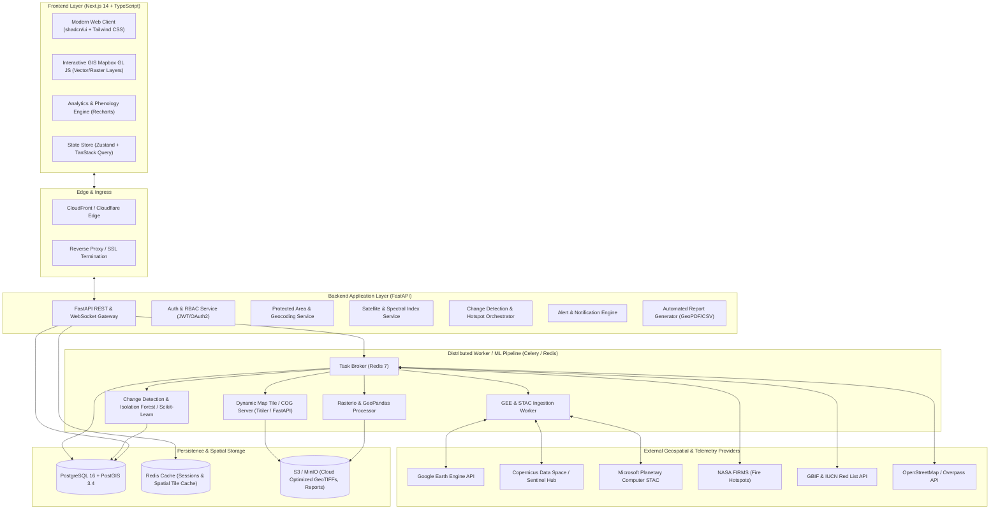
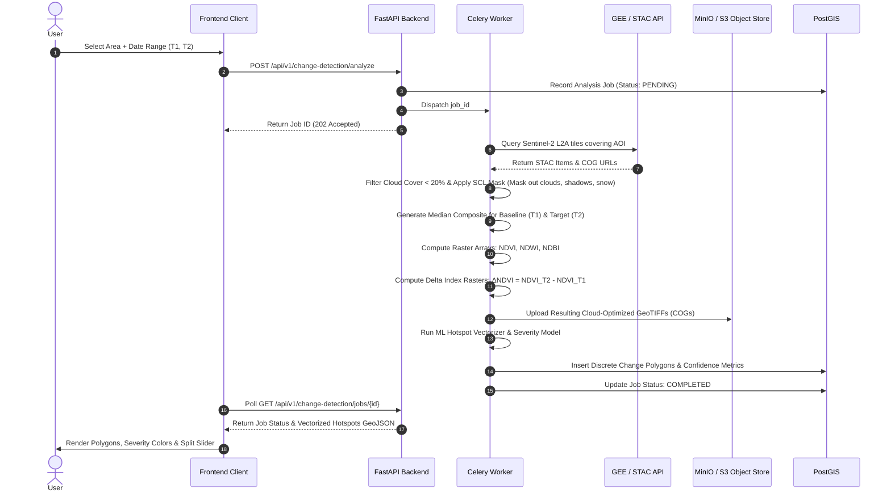

# Wildlife Watch - System Architecture Documentation

## 1. Executive Summary & Vision

**Wildlife Watch** is a production-grade, enterprise-ready Wildlife Habitat Monitoring and Change Detection Platform designed for conservation agencies, park rangers, environmental NGOs, and geospatial researchers. The platform ingests multi-spectral satellite imagery (Sentinel-2, Landsat 8/9), active thermal fire telemetry (MODIS/VIIRS), biodiversity observation records (GBIF/IUCN), and human infrastructure mapping (OpenStreetMap) to deliver continuous, automated habitat integrity monitoring, rapid-response change detection, and predictive risk scoring.

---

## 2. High-Level Architecture Diagram



---

## 3. Detailed Repository & Folder Structure

The repository follows a clean monorepo pattern partitioned into dedicated services:

```text
wildlife-watch/
├── .github/
│   └── workflows/
│       ├── frontend-ci.yml
│       ├── backend-ci.yml
│       └── docker-publish.yml
├── docs/
│   ├── ARCHITECTURE.md
│   ├── API_SPEC.md
│   ├── DATABASE_SCHEMA.md
│   ├── IMPLEMENTATION_PLAN.md
│   └── diagrams/
├── frontend/
│   ├── public/
│   │   ├── icons/
│   │   ├── markers/
│   │   └── fonts/
│   ├── src/
│   │   ├── app/
│   │   │   ├── (auth)/
│   │   │   │   ├── login/page.tsx
│   │   │   │   ├── register/page.tsx
│   │   │   │   └── forgot-password/page.tsx
│   │   │   ├── (dashboard)/
│   │   │   │   ├── layout.tsx
│   │   │   │   ├── page.tsx                         # Primary Dashboard
│   │   │   │   ├── explore/page.tsx                # Interactive Map Explorer
│   │   │   │   ├── areas/
│   │   │   │   │   ├── page.tsx                    # Saved & Monitored Areas
│   │   │   │   │   └── [id]/page.tsx               # Deep-dive Area Detail
│   │   │   │   ├── compare/page.tsx                # Dual-Epoch Satellite Compare
│   │   │   │   ├── alerts/page.tsx                 # Real-time Habitat Alerts
│   │   │   │   ├── reports/page.tsx                # Exportable Audits & Reports
│   │   │   │   ├── profile/page.tsx
│   │   │   │   └── settings/page.tsx
│   │   │   ├── api/                                # Next.js BFF proxy (if required)
│   │   │   ├── layout.tsx
│   │   │   └── globals.css
│   │   ├── components/
│   │   │   ├── ui/                                 # shadcn/ui primitives
│   │   │   │   ├── button.tsx
│   │   │   │   ├── dialog.tsx
│   │   │   │   ├── dropdown-menu.tsx
│   │   │   │   ├── slider.tsx
│   │   │   │   ├── select.tsx
│   │   │   │   ├── tabs.tsx
│   │   │   │   ├── toast.tsx
│   │   │   │   └── tooltip.tsx
│   │   │   ├── map/
│   │   │   │   ├── MapContainer.tsx                # Mapbox GL JS root controller
│   │   │   │   ├── MapLayerControl.tsx             # Layer switcher (NDVI, NDWI, Fire)
│   │   │   │   ├── SplitMapComparison.tsx          # Swipe curtain before/after
│   │   │   │   ├── ProtectedBoundaryLayer.tsx      # Vector PostGIS boundary rendering
│   │   │   │   ├── HotspotClusterLayer.tsx         # Clustered change detection markers
│   │   │   │   ├── FireHotspotLayer.tsx            # Thermal anomalies (FIRMS)
│   │   │   │   ├── DrawingControl.tsx              # Custom AOI polygon creation
│   │   │   │   ├── MapLegend.tsx                   # Dynamic raster & severity legend
│   │   │   │   └── MapTooltip.tsx                  # Spatial inspect tooltip
│   │   │   ├── dashboard/
│   │   │   │   ├── MetricCard.tsx
│   │   │   │   ├── HabitatLossSummary.tsx
│   │   │   │   ├── RecentAlertsList.tsx
│   │   │   │   ├── TopVulnerableSpecies.tsx
│   │   │   │   └── ActiveFiresCard.tsx
│   │   │   ├── analytics/
│   │   │   │   ├── PhenologyTrendChart.tsx         # Multi-year seasonal NDVI curve
│   │   │   │   ├── DeforestationBarChart.tsx       # Periodic degradation rates
│   │   │   │   ├── WaterBodyAreaChart.tsx          # Reservoir/river NDWI trend
│   │   │   │   └── HumanFootprintGauge.tsx         # Built-up index (NDBI) growth
│   │   │   ├── wildlife/
│   │   │   │   ├── SpeciesCard.tsx
│   │   │   │   ├── IUCNBadge.tsx
│   │   │   │   └── BiodiversityTimeline.tsx
│   │   │   ├── alerts/
│   │   │   │   ├── AlertCard.tsx
│   │   │   │   ├── SeverityBadge.tsx
│   │   │   │   └── AlertFilterBar.tsx
│   │   │   ├── comparison/
│   │   │   │   ├── EpochSelector.tsx
│   │   │   │   ├── DeltaStatPanel.tsx
│   │   │   │   └── IndexDiffHistogram.tsx
│   │   │   └── layout/
│   │   │       ├── Sidebar.tsx
│   │   │       ├── TopNav.tsx
│   │   │       ├── LocationSearchBox.tsx           # Global geocoder + autocomplete
│   │   │       └── UserMenu.tsx
│   │   ├── hooks/
│   │   │   ├── useMapbox.ts
│   │   │   ├── useAreaDetails.ts
│   │   │   ├── useChangeDetection.ts
│   │   │   ├── useSatelliteLayers.ts
│   │   │   └── useDebounce.ts
│   │   ├── stores/
│   │   │   ├── mapStore.ts                         # Viewport, active layers, time-range
│   │   │   ├── authStore.ts                        # User session & credentials
│   │   │   └── alertStore.ts                       # Real-time alert notifications
│   │   ├── lib/
│   │   │   ├── api-client.ts                       # Axios / Fetch wrapper with JWT interceptor
│   │   │   ├── mapbox-utils.ts                     # Tile URL builders & color ramps
│   │   │   ├── geojson-helpers.ts                  # Geometry cleaners & turf.js utils
│   │   │   └── formatters.ts                       # Hectares, coordinates, timestamps
│   │   └── types/
│   │       ├── geojson.d.ts
│   │       ├── api.ts
│   │       └── models.ts
│   ├── package.json
│   ├── tailwind.config.ts
│   └── tsconfig.json
├── backend/
│   ├── app/
│   │   ├── core/
│   │   │   ├── config.py                           # Pydantic v2 BaseSettings
│   │   │   ├── database.py                         # Async SQLAlchemy engine & PostGIS session
│   │   │   ├── security.py                         # Argon2/Bcrypt password hashing & JWT
│   │   │   ├── redis.py                            # Redis connection pool
│   │   │   └── exceptions.py                       # Global RFC 7807 error handlers
│   │   ├── api/
│   │   │   ├── v1/
│   │   │   │   ├── router.py                       # Master API v1 Router
│   │   │   │   ├── endpoints/
│   │   │   │   │   ├── auth.py
│   │   │   │   │   ├── search.py                   # Nominatim & PostGIS boundary search
│   │   │   │   │   ├── areas.py                    # Protected & saved areas
│   │   │   │   │   ├── satellite.py                # Tile proxy & spectral band endpoints
│   │   │   │   │   ├── change_detection.py         # Differencing & hotspot trigger
│   │   │   │   │   ├── fires.py                    # NASA FIRMS ingest & query
│   │   │   │   │   ├── wildlife.py                 # GBIF/IUCN occurrence data
│   │   │   │   │   ├── human_activity.py           # OSM road & urban encroachment
│   │   │   │   │   ├── analytics.py                # Historical trend aggregates
│   │   │   │   │   ├── alerts.py                   # Notification management
│   │   │   │   │   ├── reports.py                  # GeoPDF / CSV export dispatch
│   │   │   │   │   └── settings.py                 # User & alert preferences
│   │   ├── models/                                 # SQLAlchemy 2.0 / GeoAlchemy2 models
│   │   │   ├── user.py
│   │   │   ├── protected_area.py
│   │   │   ├── saved_area.py
│   │   │   ├── change_event.py
│   │   │   ├── fire_hotspot.py
│   │   │   ├── wildlife_species.py
│   │   │   ├── human_activity.py
│   │   │   ├── alert.py
│   │   │   └── report.py
│   │   ├── schemas/                                # Pydantic response & request schemas
│   │   │   ├── user.py
│   │   │   ├── geometry.py                         # GeoJSON Feature & FeatureCollection schemas
│   │   │   ├── area.py
│   │   │   ├── satellite.py
│   │   │   ├── change_detection.py
│   │   │   ├── wildlife.py
│   │   │   ├── alert.py
│   │   │   └── report.py
│   │   ├── services/                               # Core business logic
│   │   │   ├── gee_service.py                      # Earth Engine integration & token auth
│   │   │   ├── stac_service.py                     # Planetary Computer / Element84 client
│   │   │   ├── raster_service.py                   # Rasterio window reading & index math
│   │   │   ├── firms_service.py                    # NASA FIRMS CSV/GeoJSON ingestion
│   │   │   ├── gbif_service.py                     # GBIF occurrence lookup & caching
│   │   │   ├── osm_service.py                      # Overpass query & road-density calculator
│   │   │   ├── notification_service.py             # Email/WebSocket push
│   │   │   └── report_generator.py                 # Weasyprint / ReportLab GeoPDF builder
│   │   └── workers/                                # Celery distributed tasks
│   │       ├── celery_app.py
│   │       ├── tasks_satellite.py
│   │       ├── tasks_change_detection.py
│   │       ├── tasks_firms.py
│   │       └── tasks_reports.py
│   ├── tests/
│   │   ├── conftest.py
│   │   ├── test_auth.py
│   │   ├── test_areas.py
│   │   ├── test_raster_math.py
│   │   └── test_change_detection.py
│   ├── Dockerfile
│   ├── pyproject.toml
│   └── alembic/                                    # Database migrations
│       ├── env.py
│       └── versions/
├── ml/
│   ├── pipelines/
│   │   ├── change_detector.py                      # Scikit-learn Isolation Forest + CVA
│   │   ├── severity_classifier.py                  # Random Forest & Gradient Boosted ranker
│   │   ├── confidence_scorer.py                    # Multi-criteria Bayesian scoring engine
│   │   └── vectorizer.py                           # Raster binary mask to GeoJSON Polygon (DBSCAN + polygonize)
│   ├── notebooks/
│   │   ├── 01_spectral_index_validation.ipynb
│   │   ├── 02_change_vector_analysis.ipynb
│   │   └── 03_severity_and_confidence_model.ipynb
│   ├── models/
│   │   └── weights/
│   │       └── habitat_classifier_v1.pkl
│   └── tests/
├── data/
│   ├── sample_aoi/
│   │   ├── serengeti_national_park.geojson
│   │   ├── kaziranga_national_park.geojson
│   │   └── amazon_mamiraua_reserve.geojson
│   └── sample_rasters/
├── docker-compose.yml
├── docker-compose.prod.yml
├── .env.example
├── ARCHITECTURE.md
├── API_SPEC.md
├── DATABASE_SCHEMA.md
└── IMPLEMENTATION_PLAN.md
```

---

## 4. Frontend Architecture & Design Specification

### 4.1 Technology Stack & Decisions
* **Framework:** Next.js 14+ with App Router for server-rendered page shells and fast client transitions.
* **Styling & System Design:** Tailwind CSS + **shadcn/ui** (Radix UI primitives). High-contrast dark GIS theme with accessible green/amber/red/cyan data overlays.
* **Map Engine:** **Mapbox GL JS v3** with Vector Tiles, 3D terrain mesh support, Raster Tile source proxies for satellite indices, and custom canvas/WebGL shaders for rapid pixel curtain swipe.
* **State Management:**
  * `TanStack Query (React Query v5)`: Server state caching, asynchronous polling for satellite generation jobs, automated invalidation on area changes.
  * `Zustand`: Ephemeral GIS state (active layers, opacity sliders, split-screen curtain position, selected polygon ID, active time-range).
* **Data Visualization:** **Recharts** for phenological NDVI seasonality curves, multi-epoch change bars, and fire occurrence histograms.

### 4.2 Application Routes & Navigation
1. `/dashboard` - Overview hub: Monitored reserves health index, critical deforestation alerts, active fire counters, recent change polygons.
2. `/explore` - Global interactive GIS sandbox: Global search bar, WDPA protected area boundaries, live satellite overlays (True Color, NDVI, NDWI, NDBI), NASA FIRMS fire markers, custom polygon drawing tool.
3. `/areas` - Monitored Areas catalog: List of user-tracked habitats, conservation scores, and subscription statuses.
4. `/areas/[id]` - Deep-dive habitat view: Species inventory, OSM road density, vegetation phenology timeline, alert history.
5. `/compare` - Dual-epoch before/after comparison tool: Synchronized split-pane map with swipe curtain, band difference calculator, and delta metrics.
6. `/alerts` - Habitat threat alert centre: Filter by severity (Critical, High, Medium, Low), acknowledge events, dispatch field actions.
7. `/reports` - Automated audit generator: Generate GeoPDF / CSV compliance reports for specified periods and boundaries.
8. `/settings` & `/profile` - Alert thresholds, notification webhook URLs, GEE credentials, user roles.

---

## 5. Backend Architecture & Geospatial Processing

### 5.1 Technology Stack & Decisions
* **Framework:** **FastAPI (Python 3.11+)** - high-performance asynchronous ASGI framework with native OpenAPI schema generation and Pydantic v2 validation.
* **Spatial Database ORM:** **SQLAlchemy 2.0 Async + GeoAlchemy2** communicating with PostgreSQL 16 + PostGIS 3.4.
* **Asynchronous Execution:** **Celery + Redis** for long-running remote sensing ingestion, heavy matrix operations, and raster polygonization.
* **Raster Processing:** **Rasterio + GDAL + NumPy** for windowed array operations, cloud masking, and index differencing without loading unneeded tiles into memory.
* **Spatial Vector Processing:** **GeoPandas + Shapely + PyProj** for spatial intersections, reprojections (EPSG:4326 to localized UTM zones for precise metric area calculations), and topological simplification.

---

## 6. Satellite Data & Analysis Pipelines

### 6.1 Data Sources & Spectral Bands

| Satellite Platform | Revisit Time | Spatial Resolution | Key Bands Employed | Primary Purpose |
| :--- | :--- | :--- | :--- | :--- |
| **Sentinel-2 (MSI)** | 5 days | 10m - 20m | B02 (Blue), B03 (Green), B04 (Red), B08 (NIR), B11 (SWIR-1), B12 (SWIR-2), SCL/QA60 (Scene Classification) | Vegetation, water, canopy loss, urbanization |
| **Landsat 8/9 (OLI/TIRS)** | 8-16 days | 30m | B2 (Blue), B3 (Green), B4 (Red), B5 (NIR), B6 (SWIR-1), B7 (SWIR-2), QA_PIXEL | Multi-decadal historical baseline comparisons |
| **NASA FIRMS (VIIRS/MODIS)** | 12 hours | 375m (VIIRS) / 1km (MODIS) | Thermal bands (I4/I5), Brightness Temperature, FRP (Fire Radiative Power) | Near-real-time wildfire & agricultural burn detection |

### 6.2 Spectral Indices Formulation

1. **Normalized Difference Vegetation Index (NDVI):**
   $$\text{NDVI} = \frac{\text{NIR} - \text{Red}}{\text{NIR} + \text{Red}} = \frac{B08 - B04}{B08 + B04}$$
   *Evaluates photosynthetic activity, forest density, and canopy degradation.*

2. **Normalized Difference Water Index (NDWI - McFeeters / Gao):**
   $$\text{NDWI} = \frac{\text{Green} - \text{NIR}}{\text{Green} + \text{NIR}} = \frac{B03 - B08}{B03 + B08}$$
   *Delineates surface water bodies, wetlands, drought drying, and reservoir shrinkage.*

3. **Normalized Difference Built-Up Index (NDBI):**
   $$\text{NDBI} = \frac{\text{SWIR}_1 - \text{NIR}}{\text{SWIR}_1 + \text{NIR}} = \frac{B11 - B08}{B11 + B08}$$
   *Identifies roads, human settlements, illegal mining, and building encroachment.*

### 6.3 Satellite Ingestion & Cloud Masking Pipeline



---

## 7. Change Detection & Machine Learning Pipeline

### 7.1 Multi-Tier Change Detection Logic

1. **Step 1: Radiometric Harmonization & Masking**
   Images are filtered using the Sentinel-2 Scene Classification Layer (SCL) to remove clouds, high cirrus, cloud shadows, and water glint.

2. **Step 2: Change Vector Analysis (CVA)**
   We construct a multi-spectral change vector $\vec{\Delta}$ combining vegetative, moisture, and structural bands:
   $$\vec{\Delta} = \begin{bmatrix} \Delta\text{NDVI} \\ \Delta\text{NDWI} \\ \Delta\text{NDBI} \end{bmatrix}$$
   Magnitude of Change:
   $$M = \sqrt{(\Delta\text{NDVI})^2 + (\Delta\text{NDWI})^2 + (\Delta\text{NDBI})^2}$$

3. **Step 3: Statistical & Unsupervised Anomaly Isolation**
   - **Isolation Forest / Dynamic Z-Score Thresholding:** Pixels with $Z_{\Delta\text{NDVI}} < -2.0$ (statistically significant canopy drop) and $M > \tau_{\text{adaptive}}$ are marked as potential degradation candidates.
   - **Phenological Seasonal Correction:** Baseline comparison compares like-for-like calendar seasons (e.g., dry season T1 vs. dry season T2) to eliminate false positives from deciduous leaf-off.

4. **Step 4: Morphological Filtering & Spatial Clustering (DBSCAN)**
   - Morphological opening and closing (3x3 kernel) removes single-pixel salt-and-pepper sensor noise.
   - **DBSCAN Clustering:** Minimum cluster radius $\epsilon = 30\text{m}$, minimum points $= 9\text{ pixels}$ ($900\,\text{m}^2 \approx 0.09\,\text{ha}$). This ensures micro-disturbances are consolidated into meaningful habitat clearings.

5. **Step 5: Polygonization & PostGIS Metric Computation**
   - Clusters are polygonized via `rasterio.features.shapes`.
   - Polygons are smoothed using Douglas-Peucker topological simplification.
   - Exact surface area in hectares is computed using PostGIS `ST_Area(ST_Transform(geom, local_utm_srid)) / 10000.0`.

### 7.2 Severity Classification & Confidence Scoring

* **Severity Levels:**
  * **Critical:** Forest canopy loss $> 60\%$ ($\Delta\text{NDVI} < -0.4$), cluster area $> 5\,\text{ha}$, or within 1 km of active fire hotspot / critical endangered species buffer.
  * **High:** Canopy loss $35\% - 60\%$, area $> 1\,\text{ha}$, or sudden road/built-up expansion ($\Delta\text{NDBI} > +0.25$).
  * **Medium:** Canopy degradation $20\% - 35\%$ or wetland drydown ($\Delta\text{NDWI} < -0.2$).
  * **Low:** Minor vegetative stress ($10\% - 20\%$) or seasonal drying.

* **Confidence Score Formulation (0 - 100%):**
  $$\text{Confidence} = w_1 \cdot C_{\text{sensor}} + w_2 \cdot C_{\text{temporal}} + w_3 \cdot C_{\text{magnitude}} + w_4 \cdot C_{\text{context}}$$
  - $C_{\text{sensor}}$ (25%): Low cloud/shadow proximity in both acquisition epochs.
  - $C_{\text{temporal}}$ (25%): Consistency across 2 consecutive revisit passes (prevents cloud artifact glitches).
  - $C_{\text{magnitude}}$ (30%): Distance of $\Delta\text{NDVI}$ from normal seasonal variance.
  - $C_{\text{context}}$ (20%): Proximity to roads, logging corridors, or historical deforestation frontiers.

---

## 8. Communication & Integration Protocols

1. **Frontend to Backend:** RESTful JSON over HTTPS for queries, state, and user management; WebSocket (`/ws/alerts`) for real-time push of critical fire and encroachment alarms.
2. **Backend to Spatial Tile Server:** Dynamic Mapbox Vector Tiles (MVT) via PostGIS `ST_AsMVT` for protected area boundaries and change event polygons; XYZ Raster Tile URLs (`/api/v1/satellite/tiles/{z}/{x}/{y}?index=ndvi&epoch=t1`) serving WebP/PNG tiles rendered on-the-fly from Cloud-Optimized GeoTIFFs (COGs).
3. **Backend to Distributed Workers:** Redis-backed Celery message broker passing JSON payloads containing AOI WKT/GeoJSON, temporal bounding intervals, and sensor constraints.
4. **Backend to Satellite Providers:** Python Earth Engine API (`ee`), Microsoft Planetary Computer STAC API (`pystac_client`), and NASA FIRMS Open API for thermal CSV stream ingestion.

---

## 9. Security, Scalability, and Deployment

* **Security:** JWT (RS256) access & refresh tokens, password hashing with Argon2id, role-based access control (`SUPER_ADMIN`, `PARK_RANGER`, `RESEARCHER`, `VIEWER`), PostGIS SQL injection prevention via SQLAlchemy parameterized spatial queries, strict CORS policy.
* **Scalability:** Stateless FastAPI pods behind Nginx/Traefik load balancer; Redis caching for costly STAC queries and raster tile responses; PostGIS GIST indexes on all spatial geometries; Celery autoscaling workers on GPU/high-RAM compute instances for heavy raster transforms.
* **Storage:** Local MinIO or AWS S3 bucket configured for Cloud-Optimized GeoTIFFs with HTTP range-request support for windowed streaming.
