# Wildlife Watch - Database Architecture & Schema Specification

**Engine:** PostgreSQL 16  
**Spatial Extension:** PostGIS 3.4 (`postgis`, `postgis_raster`, `postgis_topology`)  
**Coordinate Reference System (CRS):**  
- Primary Storage: **EPSG:4326 (WGS 84)** for interoperability with GeoJSON and Mapbox GL JS.
- Metric Calculations: Dynamically projected to appropriate **Universal Transverse Mercator (UTM)** zone or **EPSG:3857** for area (`ST_Area`) and distance (`ST_Distance`) precision.

---

## 1. Entity Relationship (ER) Diagram

```mermaid
erDiagram
    USERS ||--o{ USER_SAVED_AREAS : "monitors"
    USERS ||--o{ ALERTS : "receives"
    USERS ||--o{ REPORTS : "generates"
    USERS ||--o{ AUDIT_LOGS : "triggers"

    PROTECTED_AREAS ||--o{ USER_SAVED_AREAS : "referenced_in"
    PROTECTED_AREAS ||--o{ HABITAT_ANALYSES : "evaluated_in"
    PROTECTED_AREAS ||--o{ CHANGE_EVENTS : "contains"
    PROTECTED_AREAS ||--o{ FIRE_HOTSPOTS : "experiences"
    PROTECTED_AREAS ||--o{ AREA_WILDLIFE_OCCURRENCES : "hosts"
    PROTECTED_AREAS ||--o{ HUMAN_ACTIVITY_INDICATORS : "encroached_by"
    PROTECTED_AREAS ||--o{ ALERTS : "targets"
    PROTECTED_AREAS ||--o{ REPORTS : "documented_in"

    WILDLIFE_SPECIES ||--o{ AREA_WILDLIFE_OCCURRENCES : "identifies"
    
    CHANGE_EVENTS ||--o{ ALERTS : "triggers"
    FIRE_HOTSPOTS ||--o{ ALERTS : "triggers"

    SATELLITE_SCENES ||--o{ HABITAT_ANALYSES : "provides_imagery"

    USERS {
        uuid id PK
        varchar email UK
        varchar password_hash
        varchar full_name
        varchar role
        varchar organization
        boolean is_active
        timestamptz created_at
        timestamptz updated_at
    }

    PROTECTED_AREAS {
        uuid id PK
        varchar wdpa_id UK
        varchar name
        varchar original_name
        varchar designation
        varchar iucn_category
        varchar country_code
        float area_km2
        geometry geom_4326
        geometry bbox_4326
        jsonb metadata
        timestamptz created_at
    }

    USER_SAVED_AREAS {
        uuid id PK
        uuid user_id FK
        uuid protected_area_id FK
        varchar custom_name
        geometry custom_geom_4326
        float alert_threshold_ndvi
        boolean fire_alerts_enabled
        boolean is_active
        timestamptz created_at
    }

    SATELLITE_SCENES {
        uuid id PK
        varchar scene_identifier UK
        varchar satellite_platform
        varchar sensor
        timestamptz acquisition_date
        float cloud_cover_percent
        geometry footprint_4326
        jsonb band_urls
        varchar storage_uri
        timestamptz ingested_at
    }

    HABITAT_ANALYSES {
        uuid id PK
        uuid protected_area_id FK
        uuid baseline_scene_id FK
        uuid target_scene_id FK
        varchar index_type
        float mean_baseline
        float mean_target
        float delta_mean
        varchar raster_cog_path
        jsonb summary_stats
        timestamptz executed_at
    }

    CHANGE_EVENTS {
        uuid id PK
        uuid protected_area_id FK
        timestamptz baseline_epoch_start
        timestamptz baseline_epoch_end
        timestamptz target_epoch_start
        timestamptz target_epoch_end
        geometry geom_4326
        float area_ha
        float mean_delta_ndvi
        varchar change_type
        varchar severity_level
        float confidence_score
        varchar status
        timestamptz detected_at
    }

    FIRE_HOTSPOTS {
        uuid id PK
        uuid protected_area_id FK
        geometry location_4326
        float brightness_temp_kelvin
        float fire_radiative_power_mw
        int confidence_percent
        varchar satellite_source
        timestamptz acquisition_timestamp
        boolean is_verified
    }

    WILDLIFE_SPECIES {
        uuid id PK
        varchar scientific_name UK
        varchar common_name
        varchar kingdom
        varchar taxon_class
        varchar iucn_status
        int gbif_taxon_key
        text habitat_description
        jsonb ecological_profile
    }

    AREA_WILDLIFE_OCCURRENCES {
        uuid id PK
        uuid protected_area_id FK
        uuid species_id FK
        geometry location_4326
        timestamptz observation_date
        varchar data_source
        varchar basis_of_record
        int individual_count
        float threat_radius_km
    }

    HUMAN_ACTIVITY_INDICATORS {
        uuid id PK
        uuid protected_area_id FK
        varchar activity_type
        geometry geom_4326
        float distance_to_boundary_m
        float metric_value
        varchar source
        timestamptz recorded_at
    }

    ALERTS {
        uuid id PK
        uuid user_id FK
        uuid protected_area_id FK
        uuid change_event_id FK
        uuid fire_hotspot_id FK
        varchar title
        text message
        varchar severity
        varchar status
        timestamptz triggered_at
        timestamptz acknowledged_at
    }

    REPORTS {
        uuid id PK
        uuid user_id FK
        uuid protected_area_id FK
        varchar title
        varchar format
        varchar file_path
        int file_size_bytes
        varchar status
        jsonb parameters
        timestamptz generated_at
    }

    AUDIT_LOGS {
        uuid id PK
        uuid user_id FK
        varchar action
        varchar resource_type
        uuid resource_id
        inet ip_address
        jsonb payload_diff
        timestamptz created_at
    }
```



---

## 2. PostgreSQL / PostGIS DDL Statements

```sql
-- Enable PostGIS extensions
CREATE EXTENSION IF NOT EXISTS "uuid-ossp";
CREATE EXTENSION IF NOT EXISTS "postgis";
CREATE EXTENSION IF NOT EXISTS "postgis_raster";
CREATE EXTENSION IF NOT EXISTS "btree_gist";

-- =============================================================================
-- 1. USERS & ACCESS CONTROL
-- =============================================================================
CREATE TYPE user_role_enum AS ENUM ('SUPER_ADMIN', 'PARK_RANGER', 'RESEARCHER', 'VIEWER');

CREATE TABLE users (
    id UUID PRIMARY KEY DEFAULT uuid_generate_v4(),
    email VARCHAR(255) NOT NULL UNIQUE,
    password_hash VARCHAR(255) NOT NULL,
    full_name VARCHAR(150) NOT NULL,
    role user_role_enum NOT NULL DEFAULT 'VIEWER',
    organization VARCHAR(200),
    is_active BOOLEAN NOT NULL DEFAULT TRUE,
    created_at TIMESTAMPTZ NOT NULL DEFAULT NOW(),
    updated_at TIMESTAMPTZ NOT NULL DEFAULT NOW()
);

CREATE INDEX idx_users_email ON users(email);
CREATE INDEX idx_users_role ON users(role);

-- =============================================================================
-- 2. PROTECTED AREAS (WDPA / IUCN / National Parks)
-- =============================================================================
CREATE TABLE protected_areas (
    id UUID PRIMARY KEY DEFAULT uuid_generate_v4(),
    wdpa_id VARCHAR(50) UNIQUE,
    name VARCHAR(255) NOT NULL,
    original_name VARCHAR(255),
    designation VARCHAR(100),
    iucn_category VARCHAR(10),
    country_code VARCHAR(3) NOT NULL,
    area_km2 DOUBLE PRECISION NOT NULL,
    geom_4326 GEOMETRY(MultiPolygon, 4326) NOT NULL,
    bbox_4326 GEOMETRY(Polygon, 4326) NOT NULL,
    metadata JSONB DEFAULT '{}'::jsonb,
    created_at TIMESTAMPTZ NOT NULL DEFAULT NOW()
);

CREATE INDEX idx_protected_areas_geom ON protected_areas USING GIST(geom_4326);
CREATE INDEX idx_protected_areas_bbox ON protected_areas USING GIST(bbox_4326);
CREATE INDEX idx_protected_areas_name_trgm ON protected_areas USING gin(name gin_trgm_ops);
CREATE INDEX idx_protected_areas_country ON protected_areas(country_code);
CREATE INDEX idx_protected_areas_iucn ON protected_areas(iucn_category);

-- =============================================================================
-- 3. USER SAVED / MONITORED HABITATS
-- =============================================================================
CREATE TABLE user_saved_areas (
    id UUID PRIMARY KEY DEFAULT uuid_generate_v4(),
    user_id UUID NOT NULL REFERENCES users(id) ON DELETE CASCADE,
    protected_area_id UUID REFERENCES protected_areas(id) ON DELETE SET NULL,
    custom_name VARCHAR(150),
    custom_geom_4326 GEOMETRY(Polygon, 4326),
    alert_threshold_ndvi DOUBLE PRECISION DEFAULT -0.25,
    fire_alerts_enabled BOOLEAN NOT NULL DEFAULT TRUE,
    is_active BOOLEAN NOT NULL DEFAULT TRUE,
    created_at TIMESTAMPTZ NOT NULL DEFAULT NOW(),
    updated_at TIMESTAMPTZ NOT NULL DEFAULT NOW()
);

CREATE INDEX idx_saved_areas_user ON user_saved_areas(user_id);
CREATE INDEX idx_saved_areas_geom ON user_saved_areas USING GIST(custom_geom_4326);

-- =============================================================================
-- 4. SATELLITE SCENES & INGESTION METADATA
-- =============================================================================
CREATE TABLE satellite_scenes (
    id UUID PRIMARY KEY DEFAULT uuid_generate_v4(),
    scene_identifier VARCHAR(150) NOT NULL UNIQUE,
    satellite_platform VARCHAR(50) NOT NULL, -- e.g. Sentinel-2A, Landsat-9
    sensor VARCHAR(50) NOT NULL,             -- e.g. MSI, OLI-2
    acquisition_date TIMESTAMPTZ NOT NULL,
    cloud_cover_percent DOUBLE PRECISION NOT NULL,
    footprint_4326 GEOMETRY(Polygon, 4326) NOT NULL,
    band_urls JSONB NOT NULL DEFAULT '{}'::jsonb,
    storage_uri VARCHAR(500),
    ingested_at TIMESTAMPTZ NOT NULL DEFAULT NOW()
);

CREATE INDEX idx_satellite_scenes_date ON satellite_scenes(acquisition_date);
CREATE INDEX idx_satellite_scenes_platform ON satellite_scenes(satellite_platform);
CREATE INDEX idx_satellite_scenes_footprint ON satellite_scenes USING GIST(footprint_4326);

-- =============================================================================
-- 5. CHANGE DETECTION EVENTS (VECTORIZED HOTSPOTS)
-- =============================================================================
CREATE TYPE severity_level_enum AS ENUM ('LOW', 'MEDIUM', 'HIGH', 'CRITICAL');
CREATE TYPE change_type_enum AS ENUM ('DEFORESTATION', 'WATER_LOSS', 'ENCROACHMENT', 'BURN_SCAR', 'CANOPY_THINNING');
CREATE TYPE event_status_enum AS ENUM ('NEW', 'VERIFIED', 'FALSE_POSITIVE', 'RESOLVED');

CREATE TABLE change_events (
    id UUID PRIMARY KEY DEFAULT uuid_generate_v4(),
    protected_area_id UUID REFERENCES protected_areas(id) ON DELETE CASCADE,
    baseline_epoch_start TIMESTAMPTZ NOT NULL,
    baseline_epoch_end TIMESTAMPTZ NOT NULL,
    target_epoch_start TIMESTAMPTZ NOT NULL,
    target_epoch_end TIMESTAMPTZ NOT NULL,
    geom_4326 GEOMETRY(MultiPolygon, 4326) NOT NULL,
    area_ha DOUBLE PRECISION NOT NULL,
    mean_delta_ndvi DOUBLE PRECISION NOT NULL,
    change_type change_type_enum NOT NULL,
    severity_level severity_level_enum NOT NULL,
    confidence_score DOUBLE PRECISION NOT NULL CHECK (confidence_score BETWEEN 0.0 AND 1.0),
    status event_status_enum NOT NULL DEFAULT 'NEW',
    detected_at TIMESTAMPTZ NOT NULL DEFAULT NOW()
) PARTITION BY RANGE (detected_at);

-- Create yearly partitions for high-throughput temporal scaling
CREATE TABLE change_events_2025 PARTITION OF change_events
    FOR VALUES FROM ('2025-01-01 00:00:00+00') TO ('2026-01-01 00:00:00+00');
CREATE TABLE change_events_2026 PARTITION OF change_events
    FOR VALUES FROM ('2026-01-01 00:00:00+00') TO ('2027-01-01 00:00:00+00');

CREATE INDEX idx_change_events_geom ON change_events USING GIST(geom_4326);
CREATE INDEX idx_change_events_severity ON change_events(severity_level);
CREATE INDEX idx_change_events_area ON change_events(protected_area_id);
CREATE INDEX idx_change_events_detected_at ON change_events(detected_at);

-- =============================================================================
-- 6. FIRE HOTSPOTS (NASA FIRMS MODIS / VIIRS)
-- =============================================================================
CREATE TABLE fire_hotspots (
    id UUID PRIMARY KEY DEFAULT uuid_generate_v4(),
    protected_area_id UUID REFERENCES protected_areas(id) ON DELETE SET NULL,
    location_4326 GEOMETRY(Point, 4326) NOT NULL,
    brightness_temp_kelvin DOUBLE PRECISION NOT NULL,
    fire_radiative_power_mw DOUBLE PRECISION NOT NULL,
    confidence_percent INT CHECK (confidence_percent BETWEEN 0 AND 100),
    satellite_source VARCHAR(30) NOT NULL, -- VIIRS_NPP, VIIRS_NOAA20, MODIS
    acquisition_timestamp TIMESTAMPTZ NOT NULL,
    is_verified BOOLEAN NOT NULL DEFAULT FALSE
) PARTITION BY RANGE (acquisition_timestamp);

CREATE TABLE fire_hotspots_2026 PARTITION OF fire_hotspots
    FOR VALUES FROM ('2026-01-01 00:00:00+00') TO ('2027-01-01 00:00:00+00');

CREATE INDEX idx_fire_hotspots_geom ON fire_hotspots USING GIST(location_4326);
CREATE INDEX idx_fire_hotspots_ts ON fire_hotspots(acquisition_timestamp);
CREATE INDEX idx_fire_hotspots_area ON fire_hotspots(protected_area_id);

-- =============================================================================
-- 7. WILDLIFE & BIODIVERSITY ENTITIES
-- =============================================================================
CREATE TYPE iucn_category_enum AS ENUM ('EX', 'EW', 'CR', 'EN', 'VU', 'NT', 'LC', 'DD', 'NE');

CREATE TABLE wildlife_species (
    id UUID PRIMARY KEY DEFAULT uuid_generate_v4(),
    scientific_name VARCHAR(150) NOT NULL UNIQUE,
    common_name VARCHAR(150) NOT NULL,
    kingdom VARCHAR(50) DEFAULT 'Animalia',
    taxon_class VARCHAR(50),
    iucn_status iucn_category_enum NOT NULL DEFAULT 'LC',
    gbif_taxon_key INT,
    habitat_description TEXT,
    ecological_profile JSONB DEFAULT '{}'::jsonb
);

CREATE INDEX idx_wildlife_species_name ON wildlife_species(common_name);
CREATE INDEX idx_wildlife_species_iucn ON wildlife_species(iucn_status);

CREATE TABLE area_wildlife_occurrences (
    id UUID PRIMARY KEY DEFAULT uuid_generate_v4(),
    protected_area_id UUID NOT NULL REFERENCES protected_areas(id) ON DELETE CASCADE,
    species_id UUID NOT NULL REFERENCES wildlife_species(id) ON DELETE CASCADE,
    location_4326 GEOMETRY(Point, 4326) NOT NULL,
    observation_date TIMESTAMPTZ NOT NULL,
    data_source VARCHAR(100) DEFAULT 'GBIF',
    basis_of_record VARCHAR(100),
    individual_count INT DEFAULT 1,
    threat_radius_km DOUBLE PRECISION DEFAULT 2.0
);

CREATE INDEX idx_area_wildlife_geom ON area_wildlife_occurrences USING GIST(location_4326);
CREATE INDEX idx_area_wildlife_area_species ON area_wildlife_occurrences(protected_area_id, species_id);

-- =============================================================================
-- 8. HUMAN ACTIVITY & INFRASTRUCTURE INDICATORS
-- =============================================================================
CREATE TABLE human_activity_indicators (
    id UUID PRIMARY KEY DEFAULT uuid_generate_v4(),
    protected_area_id UUID NOT NULL REFERENCES protected_areas(id) ON DELETE CASCADE,
    activity_type VARCHAR(100) NOT NULL, -- ROAD_NETWORK, SETTLEMENT, MINING, LOGGING
    geom_4326 GEOMETRY(Geometry, 4326) NOT NULL,
    distance_to_boundary_m DOUBLE PRECISION,
    metric_value DOUBLE PRECISION,      -- e.g. road length in meters or settlement area in m2
    source VARCHAR(100) DEFAULT 'OpenStreetMap',
    recorded_at TIMESTAMPTZ NOT NULL DEFAULT NOW()
);

CREATE INDEX idx_human_activity_geom ON human_activity_indicators USING GIST(geom_4326);
CREATE INDEX idx_human_activity_area ON human_activity_indicators(protected_area_id);

-- =============================================================================
-- 9. ALERTS & NOTIFICATIONS
-- =============================================================================
CREATE TYPE alert_status_enum AS ENUM ('UNREAD', 'ACKNOWLEDGED', 'DISMISSED');

CREATE TABLE alerts (
    id UUID PRIMARY KEY DEFAULT uuid_generate_v4(),
    user_id UUID REFERENCES users(id) ON DELETE CASCADE,
    protected_area_id UUID NOT NULL REFERENCES protected_areas(id) ON DELETE CASCADE,
    change_event_id UUID REFERENCES change_events(id) ON DELETE SET NULL,
    fire_hotspot_id UUID REFERENCES fire_hotspots(id) ON DELETE SET NULL,
    title VARCHAR(200) NOT NULL,
    message TEXT NOT NULL,
    severity severity_level_enum NOT NULL,
    status alert_status_enum NOT NULL DEFAULT 'UNREAD',
    triggered_at TIMESTAMPTZ NOT NULL DEFAULT NOW(),
    acknowledged_at TIMESTAMPTZ
);

CREATE INDEX idx_alerts_user ON alerts(user_id);
CREATE INDEX idx_alerts_status ON alerts(status);
CREATE INDEX idx_alerts_severity ON alerts(severity);
CREATE INDEX idx_alerts_triggered_at ON alerts(triggered_at);

-- =============================================================================
-- 10. AUDIT & REPORT RECORDS
-- =============================================================================
CREATE TABLE reports (
    id UUID PRIMARY KEY DEFAULT uuid_generate_v4(),
    user_id UUID NOT NULL REFERENCES users(id) ON DELETE CASCADE,
    protected_area_id UUID NOT NULL REFERENCES protected_areas(id) ON DELETE CASCADE,
    title VARCHAR(255) NOT NULL,
    format VARCHAR(20) NOT NULL DEFAULT 'GEOPDF',
    file_path VARCHAR(500),
    file_size_bytes BIGINT,
    status VARCHAR(50) NOT NULL DEFAULT 'PROCESSING',
    parameters JSONB NOT NULL DEFAULT '{}'::jsonb,
    generated_at TIMESTAMPTZ NOT NULL DEFAULT NOW()
);

CREATE TABLE audit_logs (
    id UUID PRIMARY KEY DEFAULT uuid_generate_v4(),
    user_id UUID REFERENCES users(id) ON DELETE SET NULL,
    action VARCHAR(100) NOT NULL,
    resource_type VARCHAR(100) NOT NULL,
    resource_id UUID,
    ip_address INET,
    payload_diff JSONB,
    created_at TIMESTAMPTZ NOT NULL DEFAULT NOW()
);

CREATE INDEX idx_audit_logs_user ON audit_logs(user_id);
CREATE INDEX idx_audit_logs_action ON audit_logs(action);
```

---

## 3. Spatial Optimization & Metric Calculations

### Accurate Metric Area Calculation
Because EPSG:4326 is in angular degrees, area calculations must project to a suitable planar coordinate system or use PostGIS `geography` type:

```sql
-- Calculate area of a change event polygon in Hectares
SELECT 
    id,
    ST_Area(geom_4326::geography) / 10000.0 AS area_hectares
FROM change_events
WHERE id = 'c4b12345-6789-abcd-ef01-234567890abc';
```

### Proximity Analysis: Detecting Change within Threatened Species Buffers
```sql
-- Find critical deforestation events occurring within 3km of an endangered mammal sighting
SELECT 
    ce.id AS change_event_id,
    ce.severity_level,
    ws.common_name,
    ws.iucn_status,
    ST_Distance(ce.geom_4326::geography, awo.location_4326::geography) AS distance_meters
FROM change_events ce
JOIN area_wildlife_occurrences awo 
    ON ST_DWithin(ce.geom_4326::geography, awo.location_4326::geography, 3000)
JOIN wildlife_species ws 
    ON awo.species_id = ws.id
WHERE ce.severity_level = 'CRITICAL'
  AND ws.iucn_status IN ('CR', 'EN');
```
