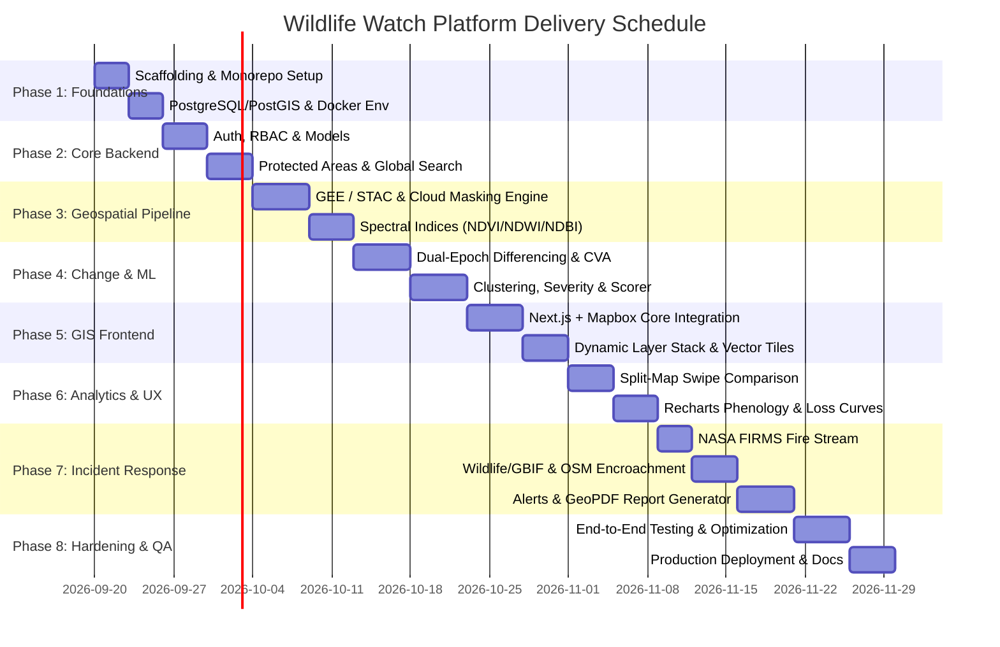

# Wildlife Watch - Implementation Roadmap & Engineering Plan

## 1. Project Overview & Scope

**Wildlife Watch** is an enterprise-grade Wildlife Habitat Monitoring and Change Detection Platform designed to detect ecosystem degradation, forest loss, wetland shrinkage, urban encroachment, and wildfire outbreaks using multi-spectral satellite imagery and spatial data science.

This document details the phase-by-phase implementation sequence, technical requirements, acceptance criteria, and testing regimens.

---

## 2. Implementation Phases & Milestones

---

### Phase 1: Environment & Project Scaffolding
* **Objectives:**
  1. Initialize monorepo directory structure (`frontend/`, `backend/`, `ml/`, `data/`, `docs/`).
  2. Setup `docker-compose.yml` for local development orchestration:
     - PostgreSQL 16 + PostGIS 3.4
     - Redis 7 (Cache and Celery Broker)
     - MinIO (S3-compatible local object storage for Cloud-Optimized GeoTIFFs)
  3. Initialize Frontend Next.js 14+ app with TypeScript, Tailwind CSS, and shadcn/ui.
  4. Initialize Backend Python environment with Poetry / pyproject.toml, FastAPI, SQLAlchemy 2.0, Alembic, and GeoAlchemy2.
* **Acceptance Criteria:**
  - `docker-compose up` cleanly provisions PostGIS, Redis, MinIO, Backend, and Frontend.
  - Health check endpoint `GET /healthz` returns `200 OK` with database connectivity status.

---

### Phase 2: Spatial Database & Core Backend Services
* **Objectives:**
  1. Write and run Alembic database migrations based on `DATABASE_SCHEMA.md`.
  2. Ingest baseline boundary dataset of global protected areas (WDPA Top 100 benchmark national parks: Serengeti, Kaziranga, Yellowstone, Yasuní, Kruger, etc.).
  3. Implement user authentication with JWT, Argon2id password hashing, and role checks.
  4. Implement `/api/v1/search/places` using Nominatim reverse geocoding and PostGIS Trigram (`pg_trgm`) fuzzy text search on park names.
  5. Implement User Saved Areas CRUD (`/api/v1/saved-areas`).
* **Acceptance Criteria:**
  - Registration and login return valid JWTs.
  - Park search responds in $< 150\,\text{ms}$ with full GeoJSON boundaries and centroid metadata.

---

### Phase 3: Satellite Ingestion & Spectral Analytics Engine
* **Objectives:**
  1. Integrate Earth Engine API (`ee`) and Microsoft Planetary Computer / Element84 STAC APIs.
  2. Build cloud-filtering and scene classification masking pipeline (Sentinel-2 SCL / Landsat QA_PIXEL).
  3. Implement windowed raster computation using `Rasterio` and `NumPy`:
     - NDVI (Canopy health)
     - NDWI (Wetland and hydrological monitoring)
     - NDBI (Urban, road, and built-up encroachment)
  4. Build dynamic raster tile endpoint `/api/v1/satellite/tiles/{z}/{x}/{y}` using Titiler / FastAPI to render colored WebP/PNG tiles with custom color ramps (Viridis, RdYlGn).
* **Acceptance Criteria:**
  - Arbitrary AOI polygon queries return cloud-masked NDVI/NDWI/NDBI rasters with accurate statistics.
  - Mapbox GL JS seamlessly streams dynamic raster tiles for requested indices.

---

### Phase 4: Change Detection & Machine Learning Classification
* **Objectives:**
  1. Build asynchronous dual-epoch differencing engine in `ml/pipelines/change_detector.py`.
  2. Compute multi-spectral change vectors: $\vec{\Delta} = [\Delta\text{NDVI}, \Delta\text{NDWI}, \Delta\text{NDBI}]^T$.
  3. Implement statistical anomaly isolation (Isolation Forest & dynamic Z-score filtering).
  4. Apply morphological cleaning and DBSCAN spatial clustering to group connected degraded pixels.
  5. Vectorize degraded pixel clusters into PostGIS MultiPolygons with metric surface area calculation in hectares.
  6. Calculate Severity Level (`CRITICAL`, `HIGH`, `MEDIUM`, `LOW`) and multi-factor Confidence Score (0-100%).
* **Acceptance Criteria:**
  - Automated detection flags canopy loss clusters $> 0.1\,\text{ha}$ within $< 30\,\text{seconds}$ for a standard reserve sector.
  - Zero polygon self-intersections; valid GeoJSON FeatureCollection generated.

---

### Phase 5: Geospatial Frontend & Interactive Map Explorer
* **Objectives:**
  1. Construct responsive dashboard layout with collapsible sidebar, top navigation, and global search bar.
  2. Integrate Mapbox GL JS v3 with custom dark theme, vector tile boundaries, and layer switcher.
  3. Implement interactive layer toggles:
     - High-resolution True Color Satellite
     - Dynamic NDVI vegetation health overlay
     - NDWI surface water overlay
     - NDBI built-up expansion overlay
     - Protected Area boundaries (WDPA)
     - NASA FIRMS Active Fire markers
  4. Build polygon drawing tool (Mapbox Draw) allowing rangers to define custom patrol monitoring zones.
* **Acceptance Criteria:**
  - 60 FPS smooth zooming, panning, and layer switching.
  - Hover tooltips display real-time habitat metrics for clicked polygons.

---

### Phase 6: Dual-Epoch Split Comparison & Analytics Dashboard
* **Objectives:**
  1. Build `/compare` view with synchronized split-pane Mapbox map and interactive swipe curtain.
  2. Side-by-side epoch selector (e.g. Dry Season 2024 vs Dry Season 2026).
  3. Interactive Recharts analytics panels:
     - Multi-year NDVI phenology curve showing seasonal variations vs anomaly drops
     - Deforestation rate bar chart per quarter
     - Surface water shrinkage trend
  4. Area Details view (`/areas/[id]`) displaying comprehensive conservation dossier.
* **Acceptance Criteria:**
  - Swipe curtain moves seamlessly across satellite epochs with synchronized viewports.
  - Recharts correctly plots temporal series aggregated from PostGIS records.

---

### Phase 7: Real-Time Incident Response, Overlays & Reporting
* **Objectives:**
  1. Ingest NASA FIRMS near-real-time fire feeds (VIIRS 375m & MODIS 1km) every 6 hours via Celery beat.
  2. Integrate GBIF API to overlay vulnerable species sightings (IUCN Red List status: CR, EN, VU).
  3. Query OpenStreetMap (Overpass API) to calculate road density ($\text{km}/\text{km}^2$) and track encroachment.
  4. Implement real-time alerts system: WebSocket push notifications and email dispatches when critical change exceeds user threshold.
  5. Build automated GeoPDF and CSV report generator using ReportLab / WeasyPrint.
* **Acceptance Criteria:**
  - Critical deforestation event immediately generates unread Alert with spatial deep-link.
  - Generated GeoPDF report includes high-res satellite map, summary statistics table, and species risk assessment.

---

### Phase 8: System Hardening, Testing & Deployment
* **Objectives:**
  1. Automated testing suite:
     - Backend: Pytest unit tests for raster math, change vector algorithms, and API endpoints.
     - Frontend: Vitest + Playwright E2E tests for map interactions and login flows.
  2. Performance optimization:
     - PostGIS spatial index vacuuming & clustering (`CLUSTER protected_areas USING idx_protected_areas_geom`).
     - Redis caching on tile server and STAC search queries.
  3. Production Docker configuration, CI/CD GitHub Actions workflows, and deployment guides.
* **Acceptance Criteria:**
  - $> 85\%$ backend test coverage.
  - All CI/CD checks pass cleanly.

---

## 3. Technology Stack Summary

| Layer | Technologies |
| :--- | :--- |
| **Frontend** | Next.js 14 (App Router), TypeScript, Tailwind CSS, shadcn/ui, Mapbox GL JS v3, Recharts, Lucide React, TanStack Query v5, Zustand |
| **Backend** | Python 3.11+, FastAPI, SQLAlchemy 2.0 (Async), GeoAlchemy2, Celery, Redis, Pydantic v2 |
| **Geospatial & ML** | PostGIS 3.4, Rasterio, GeoPandas, Shapely, NumPy, Pandas, Scikit-learn, PyProj, Titiler |
| **Data Providers** | Google Earth Engine (`ee`), Sentinel-2, Landsat 8/9, NASA FIRMS, GBIF API, OpenStreetMap (Overpass) |
| **Infra & DevOps** | Docker, Docker Compose, MinIO / S3, Nginx, GitHub Actions |

---

## 4. Verification Checkpoints

1. **Spatial Accuracy:** Reprojection to UTM ensures calculated area in hectares matches ground truth within $< 1.5\%$ variance.
2. **False Positive Mitigation:** Cloud masking (SCL bands) + Phenological calendar matching prevents cloud shadows and seasonal dry leaves from triggering false alarms.
3. **API Performance:** Read queries for vector boundaries and summary stats return $< 200\,\text{ms}$; tile rendering latency $< 350\,\text{ms}$ per tile.
